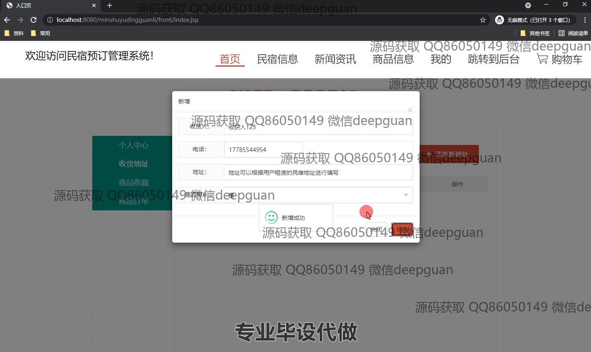
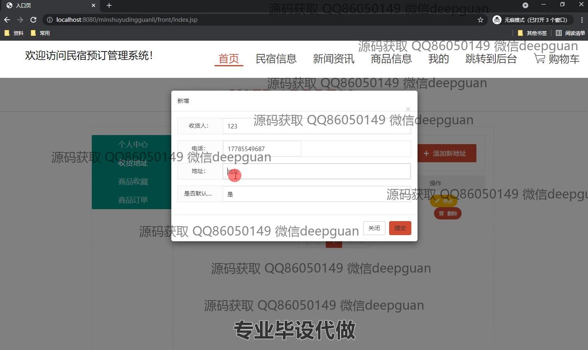
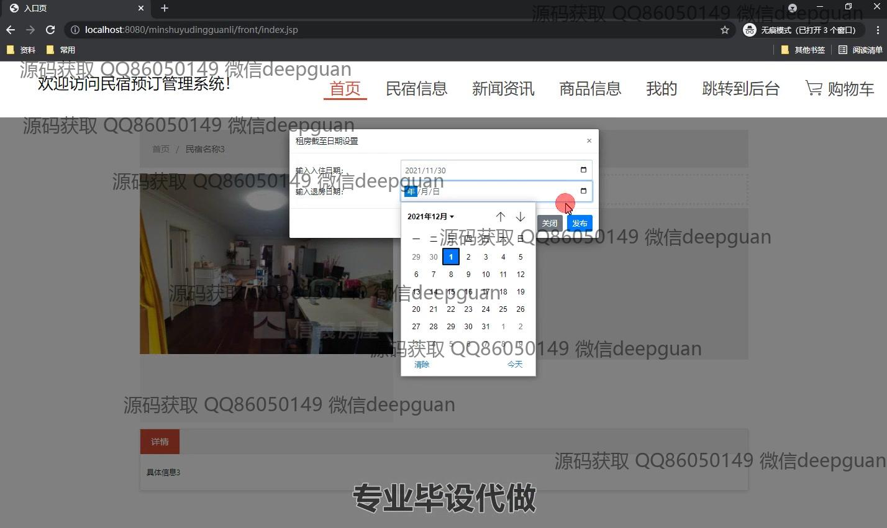
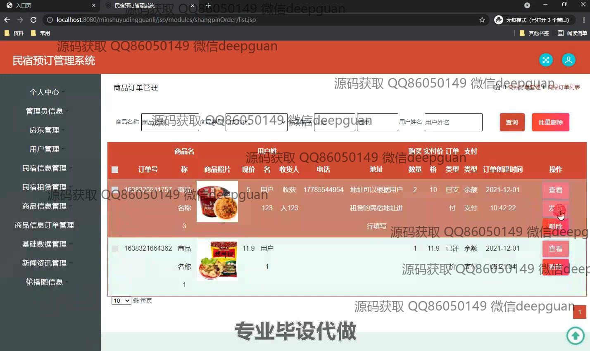
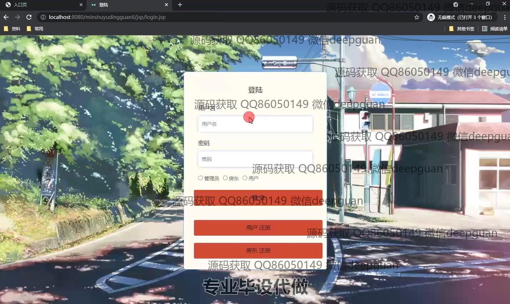
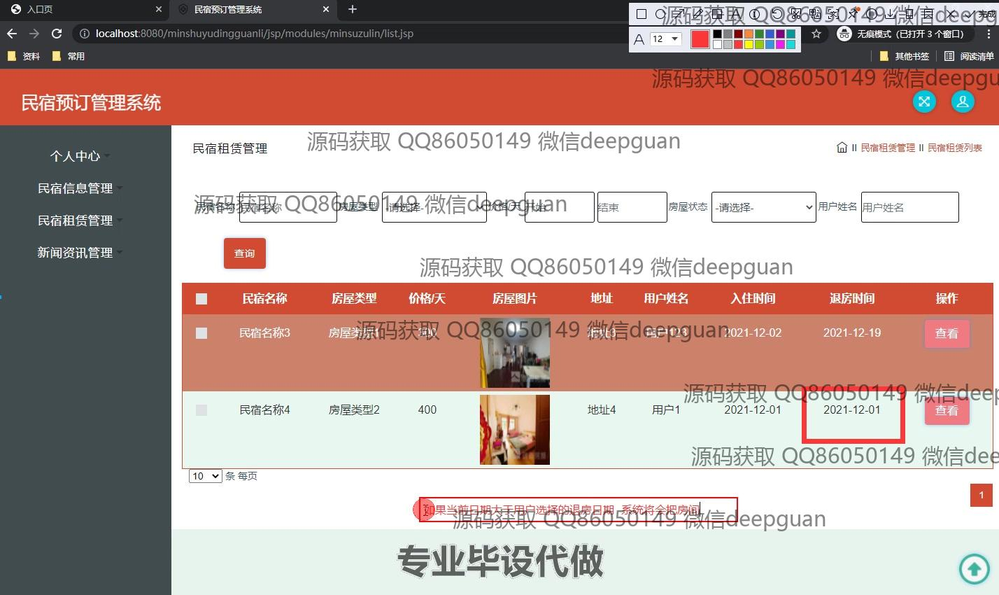
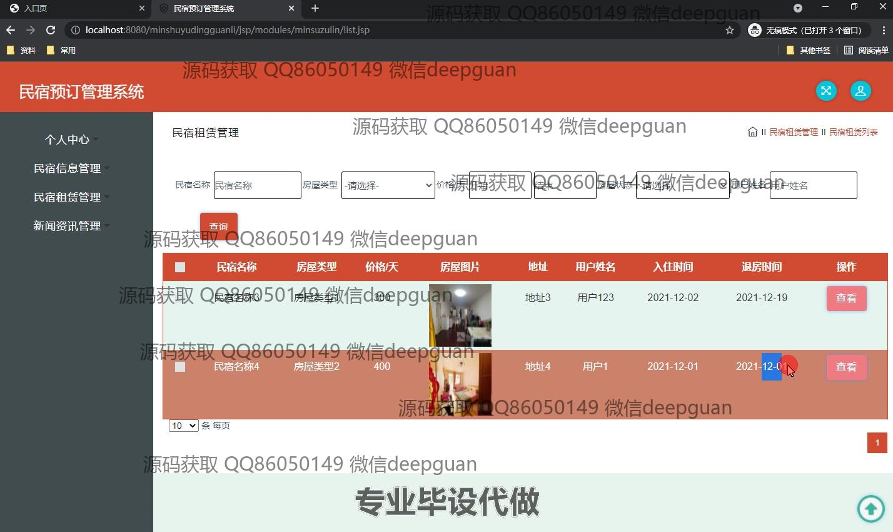

<h1 align="center">基于Java的民宿预订管理系统的设计与实现+jsp</h1>

## 简介
民宿预订管理系统：角色分为管理员、用户；功能包括用户注册登录、地址管理、商品信息管理、民宿租赁管理、订单管理、新闻资讯管理、后台审核等。    --计算机毕业设计源码；毕设源码；java毕业设计源码

## 联系方式

<h3 align="center">获取完整代码与数据库文件 + 微信：deepguan QQ: 86050149 QQ群: 783742310</h3>

<h3 align="center">可帮忙远程部署 包运行成功！提供远程部署、修改代码、设计文档指导、代码讲解等服务！</h3>

## 功能介绍（完整见运行截图）
管理员：基本功能包括登录、注册和退出。主页提供主导航栏访问民宿内容、新闻资讯和商品信息。支持民宿信息的管理、查询、添加和批量删除，包含房东信息、房屋类型、价格和地址等。可以管理商品信息，进行商品查询、添加、删除、库存修改等操作。管理租赁信息，可按条件查询民宿租赁状况。用户订单管理功能支持查看、删除、退款等订单操作。

用户：可以通过注册与登录访问个人中心，管理收货地址和商品收藏。主页导航栏提供快捷访问到民宿信息、新闻资讯和商品简介。支持查询和预订民宿，输入入住和退房日期后，可发布预订请求并获取确认信息。商品模块提供搜索与查看详情选项，可进行收藏、加入购物车及购买操作。在个人中心查看和修改个人信息、管理订单和地址。

## 运行截图

本代码来源于网络,仅供学习参考使用!

